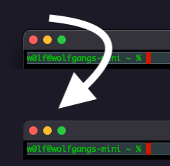

# noShadows

# Information:

- Designed for 10.14+
- MacForge plugin that removes shadows from windows on macOS
- Author: [MacEnhance](https://github.com/MacEnhance)

# Functionality:

- When a window gains focus, noShadows will try to turn off the shadows using `[window setHasShadow:false];`
- Note that this doesn't affect windows with custom drawn shadows

# Blacklisting:

- To add an app the blacklist

1. Find the bundle ID of the application you want to blacklist, e.g. `com.googlecode.iterm2`
2. Open `/System/Applications/Utilities/Terminal.app`
3. Enter the command `defaults write com.googlecode.iterm2 noShadows -bool true`
4. Restart the application

- To remove an app, enter the command  ``defaults delete com.googlecode.iterm2 noShadows`

# Installation:

1. Download and open [MacForge](https://github.com/w0lfschild/app_updates/raw/master/MacForge1/MacForge.zip)
2. Install [noShadows](https://www.macenhance.com/mflink?com.macenhance.noShadows)
